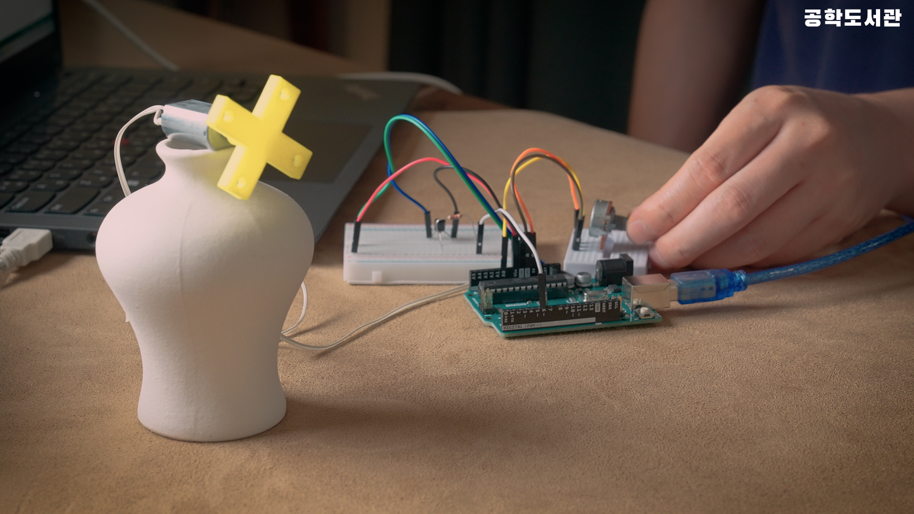
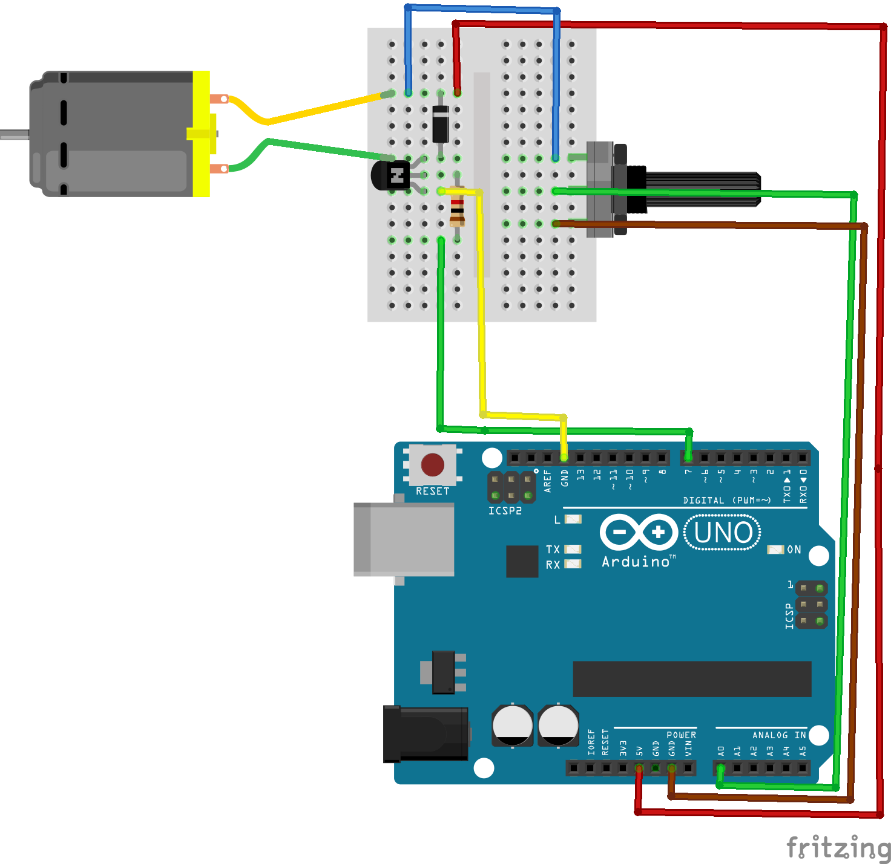
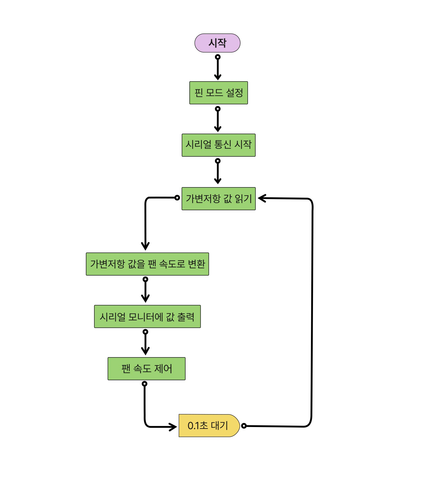

# 🎬 공학도서관 오리지널 컨텐츠

# 🌪️ 선풍기 만들기

## 📝 프로젝트 소개
이 프로젝트는 아두이노와 DC 모터를 활용하여 가변저항으로 속도를 조절할 수 있는 선풍기를 만드는 과정을 설명합니다. 3단계가 아닌 104단계로 세밀하게 속도를 제어할 수 있는 나만의 선풍기를 만들어볼 수 있습니다.

## 📚 사전학습
이 프로젝트를 시작하기 전에 아래 내용을 먼저 공부하고 오시면 좋아요.

- 아두이노 기초
  - 아두이노 IDE 설치하기
  - analogRead() 함수 이해하기
  - analogWrite() 함수 이해하기
  - map() 함수 활용하기

- 전자부품 이해하기
  - 트랜지스터의 기본 개념 알아보기
  - 가변저항 사용법 익히기
  - DC 모터 제어 방법 이해하기

- 프로그래밍 기초
  - 변수 활용하기
  - 시리얼 통신 이해하기
  - 아날로그/디지털 신호 이해하기

## 🎯 성취 목표
- 가변저항으로 모터의 속도를 자유롭게 제어할 수 있다.
- 아날로그 값을 읽어 모터 속도로 변환할 수 있다.
- 트랜지스터를 이용하여 DC 모터를 제어할 수 있다.
- map() 함수를 사용하여 값의 범위를 변환할 수 있다.
- 시리얼 모니터로 가변저항과 모터 속도값을 확인할 수 있다.

## 🛠 준비물
- 아두이노 우노 보드
- 5V DC 모터
- 다이오드 (1N5817)
- NPN 트랜지스터 (2N3904)
- 가변저항 10kΩ
- M-M 점퍼선 6개
- USB 2.0 케이블 Type A/B

## 📋 회로 연결 방법

### 트랜지스터 연결
| Arduino UNO | NPN 트랜지스터 |
|------------|----------------|
| D6         | Base          |
| 5V         | Collector     |
| GND        | Emitter       |

### 가변저항 연결
| Arduino UNO | 가변저항 |
|------------|---------|
| A0         | 중간 핀 |
| 5V         | 왼쪽 핀 |
| GND        | 오른쪽 핀 |

> **주의**: 회로 연결 시 반드시 아두이노의 전원을 끄고 진행하세요!

## 💾 실습 코드
| 파일명 | 설명 |
|--------|------|
| [v0_1.ino](./src/v0_1/v0_1.ino) | 선풍기 제어 기본 코드 |

## 💻 주요 함수 설명
1. `analogRead(potPin)`
   - 가변저항의 값을 0-1023 범위로 읽어오는 함수
   - A0 핀에 연결된 가변저항 값 읽기

2. `map(potValue, 0, 1023, 0, 255)`
   - 가변저항 값(0-1023)을 모터 속도(0-255)로 변환
   - 입력 범위를 출력 범위로 자동 변환

## ➡️ 순서도

## 🚀 시작하기
1. 회로를 제시된 도면대로 연결
   - 트랜지스터 방향에 주의하며 연결하기
   - 모터의 극성 확인하기

2. 코드 업로드 준비
   - 아두이노와 컴퓨터 연결
   - Arduino IDE에서 보드와 포트 선택
   - 예제 코드 다운로드 및 IDE에서 열기

3. 코드 업로드하기
   - 코드 검증 (체크 버튼)
   - 업로드 버튼 클릭
   - 업로드 완료 메시지 확인

4. 동작 테스트
   - 시리얼 모니터 열기 (9600 baud)
   - 가변저항을 돌려가며 값 확인
   - 모터 속도 변화 확인

5. 프로펠러 장착
   - 모터 정지 상태에서 장착
   - 프로펠러 고정 상태 확인

## 🔍 문제해결
- 모터가 동작하지 않아요
  - 트랜지스터의 방향이 올바른지 확인해보세요. 핀 배치도를 참고해 주세요.
  - 모터에 전원이 제대로 연결되었는지 확인해보세요.

- 속도 조절이 안 돼요
  - 가변저항이 제대로 연결되어 있는지 확인해보세요.
  - 시리얼 모니터에서 가변저항 값이 변하는지 확인해보세요.

- 모터가 덜덜 떨려요
  - 모터와 프로펠러가 단단히 고정되어 있는지 확인해보세요.
  - 브레드보드 연결이 느슨하지 않은지 살펴보세요.

## 🌟 이렇게 업그레이드 해볼 수 있어요
- 버튼을 추가해서 풍량 단계를 저장해볼까요?
  자주 쓰는 세기를 미리 저장해두고 버튼으로 불러올 수 있어요.

- LCD 화면으로 현재 속도를 표시해보면 어떨까요?
  가변저항 값과 모터 속도를 한눈에 확인할 수 있어요.

- 타이머 기능을 추가해볼까요?
  정해진 시간 동안만 동작하게 할 수 있어요.

## 📚 참고 자료
- [트랜지스터 기초]()
